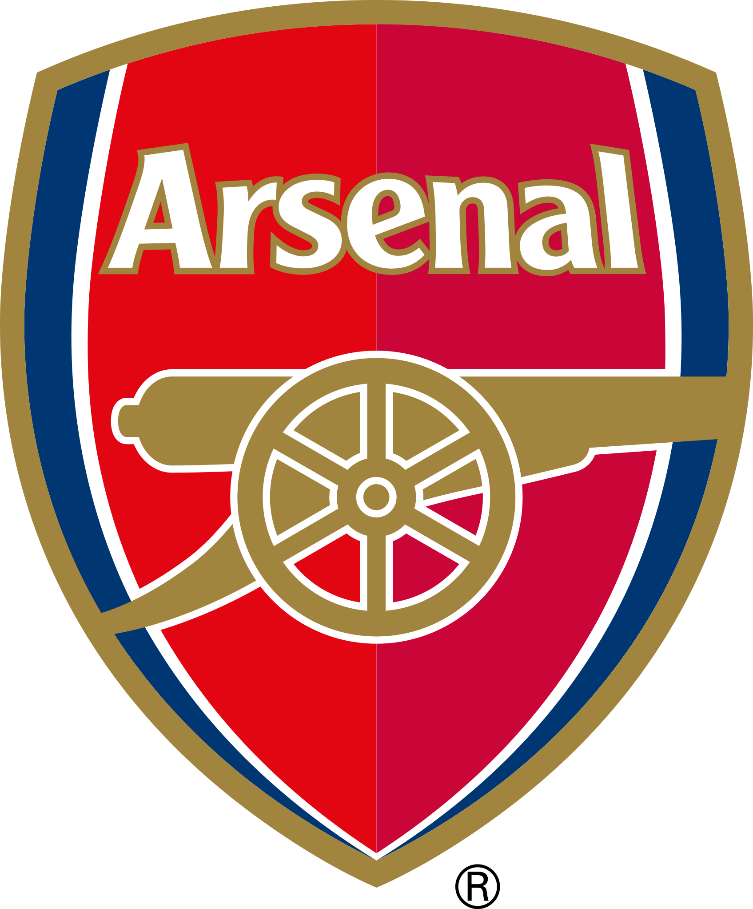
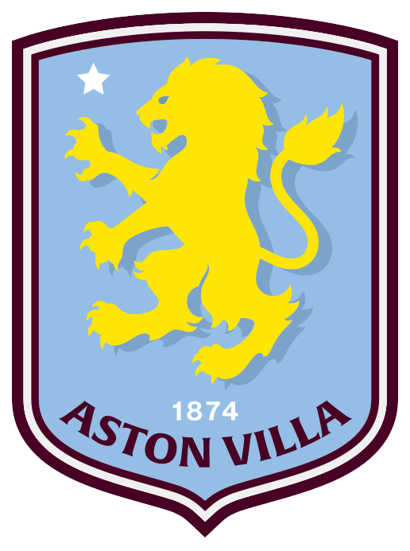
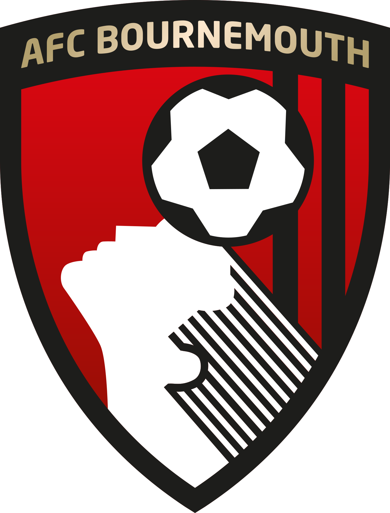
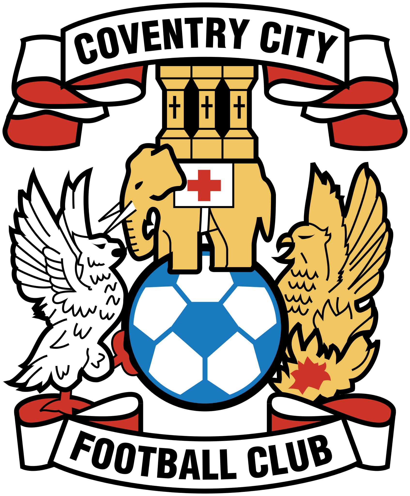
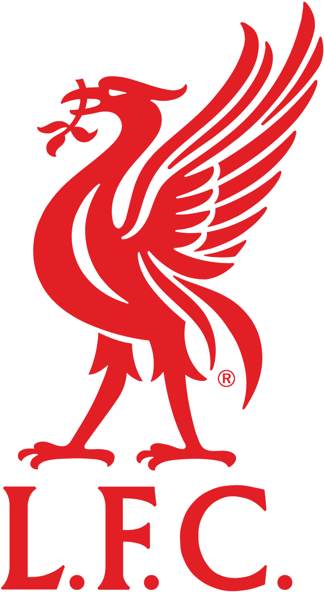
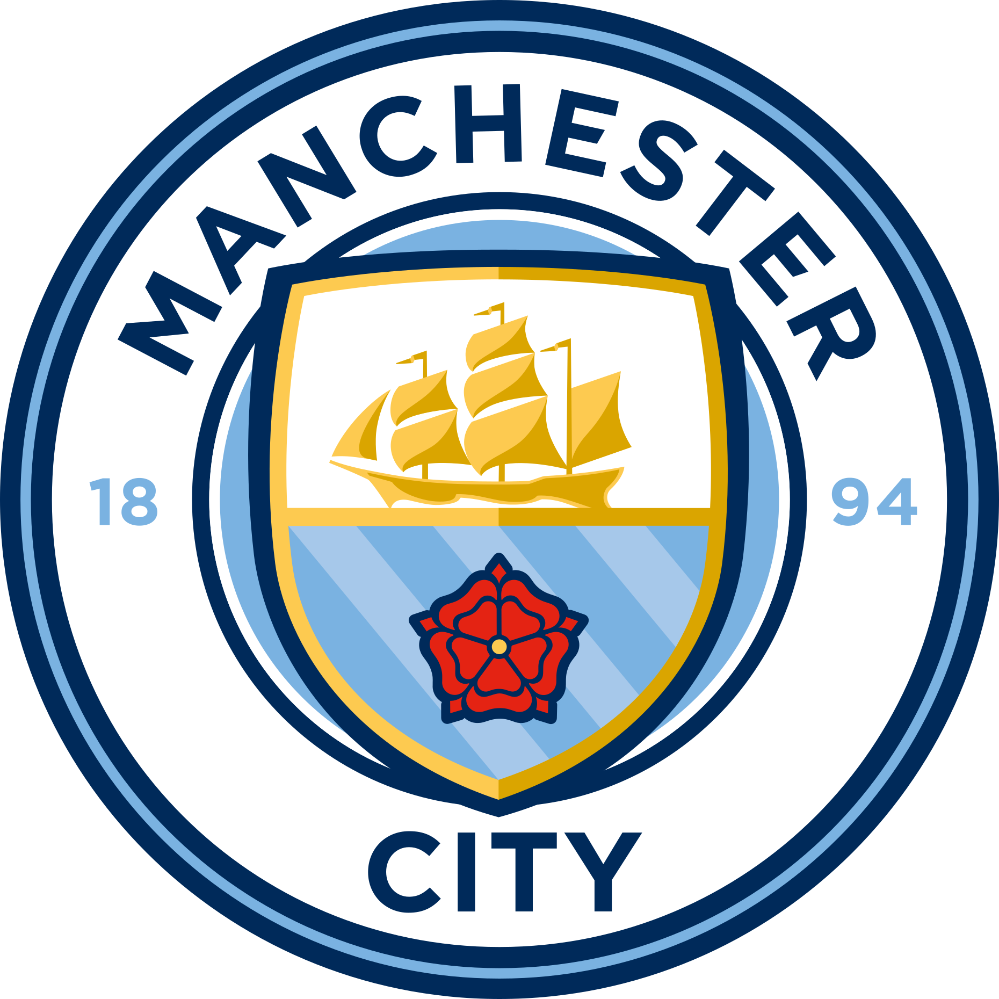

# Intro

The English Premier League (EPL) pre-season is underway. It's a time for fitness, opportunities for youth, team bonding, squad building and tactical trials among other things. Match outcomes are largely meaningless, but can influence the narrative, tone and group morale heading into the new campaign. <br> <br>This post summarizes pre-season schedules for each EPL team ahead of the 2026/2027 campaign that begins on August 21st 2026. Updates will be provided periodically.

::: {.callout-important appearance="default"}
## Note
BCD: Behind Closed Doors\
Club match report links added post match\
Last update: July 18


:::

The following R packages were used:

`tidyverse`\
`reactable`\
`htmltools`\

[@Wickham2019; @Lin2025; @Cheng2025]

## {width="30"} Arsenal


```{r message=FALSE, warning=FALSE}

#| warning: false
#| echo: false
#| fig-height: 10
#| fig-width: 15
#| fig-dpi: 600
#| column: 600

library(htmltools)
library(tidyverse)
library(reactable)


### load data
data <- read.csv(file = "data/arsenal_ps.csv")

# Set the default theme for all tables
options(reactable.theme = reactableTheme(
  color = 'black',
  backgroundColor = 'white',
  borderColor = "hsl(233, 9%, 22%)",
  stripedColor = "hsl(233, 12%, 22%)",
  highlightColor = "#F2F2F2",
  inputStyle = list(backgroundColor = "hsl(233, 9%, 25%)"),
  selectStyle = list(backgroundColor = "hsl(233, 9%, 25%)"),
  pageButtonHoverStyle = list(backgroundColor = "hsl(233, 9%, 25%)"),
  pageButtonActiveStyle = list(backgroundColor = "hsl(233, 9%, 28%)")
))


arsenal <-reactable(
  data,
  highlight = TRUE,
  columns = list(
    date = colDef(style = list(color = "gray20", fontSize = "15px"), show = TRUE, align = "center", maxWidth = 100, name = "Date"),
    score = colDef(show = TRUE, align = "center", maxWidth = 75, name = 'Score'),
    opponent_name = colDef(style = list(color = "black", fontWeight = "bold", fontSize = "15px"), show = TRUE, align = "left", maxWidth = 250, name = "Opponent"),
    match_report = colDef(style = list(color = "black", fontSize = "15px"), show = TRUE, align = "center", maxWidth = 125, name = 'Report',
                          cell = function(value, index) {
                            url <- value 
                            htmltools::tags$a(href = url, target = "_blank", as.character("Report"))
                          }),
    note = colDef(style = list(color = "black", fontSize = "15px"), show = TRUE, align = "center", maxWidth = 900, name = "Note"),
    team = colDef(show = FALSE),
    team_logo = colDef(show = FALSE),
    opponent_logo = colDef(show = FALSE),
    #opponent = colDef(show = TRUE, align = "center", maxWidth = 100),
    location = colDef(style = list(color = "black", fontSize = "15px"), show = TRUE, align = "center", maxWidth = 150, name = "Location"),
    opta_rating = colDef(show = FALSE, name = "opponent Opta Rating", align = "center"),
    opponent = colDef(show = FALSE)))

arsenal


```

## {width="30"} Aston Villa


```{r message=FALSE, warning=FALSE}

#| warning: false
#| echo: false
#| fig-height: 10
#| fig-width: 15
#| fig-dpi: 600
#| column: 600

library(htmltools)
library(tidyverse)
library(reactable)


### load data
data2 <-read.csv(file = "data/astonvilla_ps.csv")

# Set the default theme for all tables
options(reactable.theme = reactableTheme(
  color = 'black',
  backgroundColor = 'white',
  borderColor = "hsl(233, 9%, 22%)",
  stripedColor = "hsl(233, 12%, 22%)",
  highlightColor = "#F2F2F2",
  inputStyle = list(backgroundColor = "hsl(233, 9%, 25%)"),
  selectStyle = list(backgroundColor = "hsl(233, 9%, 25%)"),
  pageButtonHoverStyle = list(backgroundColor = "hsl(233, 9%, 25%)"),
  pageButtonActiveStyle = list(backgroundColor = "hsl(233, 9%, 28%)")
))


aston_villa <-reactable(
  data2,
  highlight = TRUE,
  columns = list(
    date = colDef(style = list(color = "gray20", fontSize = "15px"), show = TRUE, align = "center", maxWidth = 100, name = "Date"),
    score = colDef(show = TRUE, align = "center", maxWidth = 75, name = 'Score'),
    opponent_name = colDef(style = list(color = "black", fontWeight = "bold", fontSize = "15px"), show = TRUE, align = "left", maxWidth = 250, name = "Opponent"),
    match_report = colDef(style = list(color = "black", fontSize = "15px"), show = TRUE, align = "center", maxWidth = 125, name = 'Report',
                          cell = function(value, index) {
                            url <- value 
                            htmltools::tags$a(href = url, target = "_blank", as.character("Report"))
                          }),
    note = colDef(style = list(color = "black", fontSize = "15px"), show = TRUE, align = "center", maxWidth = 900, name = "Note"),
    team = colDef(show = FALSE),
    team_logo = colDef(show = FALSE),
    opponent_logo = colDef(show = FALSE),
    #opponent = colDef(show = TRUE, align = "center", maxWidth = 100),
    location = colDef(style = list(color = "black", fontSize = "15px"), show = TRUE, align = "center", maxWidth = 150, name = "Location"),
    opta_rating = colDef(show = FALSE, name = "opponent Opta Rating", align = "center"),
    opponent = colDef(show = FALSE)))
    #opponent = colDef(style = list(color = "black", fontSize = "0px", fontWeight = "bold"), name = '', align = "center", maxWidth = 100, cell = function(value) {
      #img_src <- knitr::image_uri(sprintf("images/%s.png", value))
     # image <- img(src = img_src, style = "height: 35px;", alt = value)
    #  tagList(
     #   div(style = "display: inline-block; width: 75px", image),
    #    value
   #   )
   # })
 # )
#)

aston_villa

```

## {width="25"} Bournemouth


```{r message=FALSE, warning=FALSE}

#| warning: false
#| echo: false
#| fig-height: 10
#| fig-width: 15
#| fig-dpi: 600
#| column: 600

library(htmltools)
library(tidyverse)
library(reactable)


### load data
data3 <- read.csv(file = "data/bournemouth_ps.csv")

# Set the default theme for all tables
options(reactable.theme = reactableTheme(
  color = 'black',
  backgroundColor = 'white',
  borderColor = "hsl(233, 9%, 22%)",
  stripedColor = "hsl(233, 12%, 22%)",
  highlightColor = "#F2F2F2",
  inputStyle = list(backgroundColor = "hsl(233, 9%, 25%)"),
  selectStyle = list(backgroundColor = "hsl(233, 9%, 25%)"),
  pageButtonHoverStyle = list(backgroundColor = "hsl(233, 9%, 25%)"),
  pageButtonActiveStyle = list(backgroundColor = "hsl(233, 9%, 28%)")
))


bournemouth <-reactable(
  data3,
  highlight = TRUE,
  columns = list(
    date = colDef(style = list(color = "gray20", fontSize = "15px"), show = TRUE, align = "center", maxWidth = 100, name = "Date"),
    score = colDef(show = TRUE, align = "center", maxWidth = 75, name = 'Score'),
    opponent_name = colDef(style = list(color = "black", fontWeight = "bold", fontSize = "15px"), show = TRUE, align = "left", maxWidth = 250, name = "Opponent"),
    match_report = colDef(style = list(color = "black", fontSize = "15px"), show = TRUE, align = "center", maxWidth = 125, name = 'Report',
                          cell = function(value, index) {
                            url <- value 
                            htmltools::tags$a(href = url, target = "_blank", as.character("Report"))
                          }),
    note = colDef(style = list(color = "black", fontSize = "15px"), show = TRUE, align = "center", maxWidth = 900, name = "Note"),
    team = colDef(show = FALSE),
    team_logo = colDef(show = FALSE),
    opponent_logo = colDef(show = FALSE),
    #opponent = colDef(show = TRUE, align = "center", maxWidth = 100),
    location = colDef(style = list(color = "black", fontSize = "15px"), show = TRUE, align = "center", maxWidth = 150, name = "Location"),
    opta_rating = colDef(show = FALSE, name = "opponent Opta Rating", align = "center"),
    opponent = colDef(show = FALSE)))

bournemouth


```

## {width="25"} Brentford


```{r message=FALSE, warning=FALSE}

#| warning: false
#| echo: false
#| fig-height: 10
#| fig-width: 15
#| fig-dpi: 600
#| column: 600

library(htmltools)
library(tidyverse)
library(reactable)


### load data
data4 <- read.csv(file = "data/brentford_ps.csv")

# Set the default theme for all tables
options(reactable.theme = reactableTheme(
  color = 'black',
  backgroundColor = 'white',
  borderColor = "hsl(233, 9%, 22%)",
  stripedColor = "hsl(233, 12%, 22%)",
  highlightColor = "#F2F2F2",
  inputStyle = list(backgroundColor = "hsl(233, 9%, 25%)"),
  selectStyle = list(backgroundColor = "hsl(233, 9%, 25%)"),
  pageButtonHoverStyle = list(backgroundColor = "hsl(233, 9%, 25%)"),
  pageButtonActiveStyle = list(backgroundColor = "hsl(233, 9%, 28%)")
))


brentford <-reactable(
  data4,
  highlight = TRUE,
  columns = list(
    date = colDef(style = list(color = "gray20", fontSize = "15px"), show = TRUE, align = "center", maxWidth = 100, name = "Date"),
    score = colDef(show = TRUE, align = "center", maxWidth = 75, name = 'Score'),
    opponent_name = colDef(style = list(color = "black", fontWeight = "bold", fontSize = "15px"), show = TRUE, align = "left", maxWidth = 250, name = "Opponent"),
    match_report = colDef(style = list(color = "black", fontSize = "15px"), show = TRUE, align = "center", maxWidth = 125, name = 'Report',
                          cell = function(value, index) {
                            url <- value 
                            htmltools::tags$a(href = url, target = "_blank", as.character("Report"))
                          }),
    note = colDef(style = list(color = "black", fontSize = "15px"), show = TRUE, align = "center", maxWidth = 900, name = "Note"),
    team = colDef(show = FALSE),
    team_logo = colDef(show = FALSE),
    opponent_logo = colDef(show = FALSE),
    #opponent = colDef(show = TRUE, align = "center", maxWidth = 100),
    location = colDef(style = list(color = "black", fontSize = "15px"), show = TRUE, align = "center", maxWidth = 150, name = "Location"),
    opta_rating = colDef(show = FALSE, name = "opponent Opta Rating", align = "center"),
    opponent = colDef(show = FALSE)))

brentford


```

## {width="25"} Brighton


```{r message=FALSE, warning=FALSE}

#| warning: false
#| echo: false
#| fig-height: 10
#| fig-width: 15
#| fig-dpi: 600
#| column: 600

library(htmltools)
library(tidyverse)
library(reactable)


### load data
data5 <- read.csv(file = "data/brighton_ps.csv")

# Set the default theme for all tables
options(reactable.theme = reactableTheme(
  color = 'black',
  backgroundColor = 'white',
  borderColor = "hsl(233, 9%, 22%)",
  stripedColor = "hsl(233, 12%, 22%)",
  highlightColor = "#F2F2F2",
  inputStyle = list(backgroundColor = "hsl(233, 9%, 25%)"),
  selectStyle = list(backgroundColor = "hsl(233, 9%, 25%)"),
  pageButtonHoverStyle = list(backgroundColor = "hsl(233, 9%, 25%)"),
  pageButtonActiveStyle = list(backgroundColor = "hsl(233, 9%, 28%)")
))


brighton <-reactable(
  data5,
  highlight = TRUE,
  columns = list(
    date = colDef(style = list(color = "gray20", fontSize = "15px"), show = TRUE, align = "center", maxWidth = 100, name = "Date"),
    score = colDef(show = TRUE, align = "center", maxWidth = 75, name = 'Score'),
    opponent_name = colDef(style = list(color = "black", fontWeight = "bold", fontSize = "15px"), show = TRUE, align = "left", maxWidth = 250, name = "Opponent"),
    video_up = colDef(html = TRUE, align = "center", maxWidth = 100, name = 'Video', cell = function(value, index) {
      sprintf('<a href="%s" target="_blank">%s</a>', data5$video[index], value)
    }),
    video = colDef(show = FALSE),
    report = colDef(html = TRUE, align = "center", maxWidth = 100, name = 'Report', cell = function(value, index) {
      sprintf('<a href="%s" target="_blank">%s</a>', data5$match_report[index], value)
    }),
    match_report = colDef(show = FALSE),
    note = colDef(style = list(color = "black", fontSize = "15px"), show = TRUE, align = "center", maxWidth = 900, name = "Note"),
    team = colDef(show = FALSE),
    team_logo = colDef(show = FALSE),
    opponent_logo = colDef(show = FALSE),
    #opponent = colDef(show = TRUE, align = "center", maxWidth = 100),
    location = colDef(style = list(color = "black", fontSize = "15px"), show = TRUE, align = "center", maxWidth = 150, name = "Location"),
    opta_rating = colDef(show = FALSE, name = "opponent Opta Rating", align = "center"),
    opponent = colDef(show = FALSE)))
brighton


```

## {width="25"} Chelsea


```{r message=FALSE, warning=FALSE}

#| warning: false
#| echo: false
#| fig-height: 10
#| fig-width: 15
#| fig-dpi: 600
#| column: 600

library(htmltools)
library(tidyverse)
library(reactable)


### load data
data6 <- read.csv(file = "data/chelsea_ps.csv")

# Set the default theme for all tables
options(reactable.theme = reactableTheme(
  color = 'black',
  backgroundColor = 'white',
  borderColor = "hsl(233, 9%, 22%)",
  stripedColor = "hsl(233, 12%, 22%)",
  highlightColor = "#F2F2F2",
  inputStyle = list(backgroundColor = "hsl(233, 9%, 25%)"),
  selectStyle = list(backgroundColor = "hsl(233, 9%, 25%)"),
  pageButtonHoverStyle = list(backgroundColor = "hsl(233, 9%, 25%)"),
  pageButtonActiveStyle = list(backgroundColor = "hsl(233, 9%, 28%)")
))


chelsea <-reactable(
  data6,
  highlight = TRUE,
  columns = list(
    date = colDef(style = list(color = "gray20", fontSize = "15px"), show = TRUE, align = "center", maxWidth = 100, name = "Date"),
    score = colDef(show = TRUE, align = "center", maxWidth = 75, name = 'Score'),
    opponent_name = colDef(style = list(color = "black", fontWeight = "bold", fontSize = "15px"), show = TRUE, align = "left", maxWidth = 250, name = "Opponent"),
    match_report = colDef(style = list(color = "black", fontSize = "15px"), show = TRUE, align = "center", maxWidth = 125, name = 'Report',
                          cell = function(value, index) {
                            url <- value 
                            htmltools::tags$a(href = url, target = "_blank", as.character("Report"))
                          }),
    note = colDef(style = list(color = "black", fontSize = "15px"), show = TRUE, align = "center", maxWidth = 900, name = "Note"),
    team = colDef(show = FALSE),
    team_logo = colDef(show = FALSE),
    opponent_logo = colDef(show = FALSE),
    #opponent = colDef(show = TRUE, align = "center", maxWidth = 100),
    location = colDef(style = list(color = "black", fontSize = "15px"), show = TRUE, align = "center", maxWidth = 150, name = "Location"),
    opta_rating = colDef(show = FALSE, name = "opponent Opta Rating", align = "center"),
    opponent = colDef(show = FALSE)))

chelsea


```

## {width="25"} Coventry


```{r message=FALSE, warning=FALSE}

#| warning: false
#| echo: false
#| fig-height: 10
#| fig-width: 15
#| fig-dpi: 600
#| column: 600

library(htmltools)
library(tidyverse)
library(reactable)


### load data
data7 <- read.csv(file = "data/coventry_ps.csv")

# Set the default theme for all tables
options(reactable.theme = reactableTheme(
  color = 'black',
  backgroundColor = 'white',
  borderColor = "hsl(233, 9%, 22%)",
  stripedColor = "hsl(233, 12%, 22%)",
  highlightColor = "#F2F2F2",
  inputStyle = list(backgroundColor = "hsl(233, 9%, 25%)"),
  selectStyle = list(backgroundColor = "hsl(233, 9%, 25%)"),
  pageButtonHoverStyle = list(backgroundColor = "hsl(233, 9%, 25%)"),
  pageButtonActiveStyle = list(backgroundColor = "hsl(233, 9%, 28%)")
))


coventry <-reactable(
  data7,
  highlight = TRUE,
  columns = list(
    date = colDef(style = list(color = "gray20", fontSize = "15px"), show = TRUE, align = "center", maxWidth = 100, name = "Date"),
    score = colDef(show = TRUE, align = "center", maxWidth = 75, name = 'Score'),
    opponent_name = colDef(style = list(color = "black", fontWeight = "bold", fontSize = "15px"), show = TRUE, align = "left", maxWidth = 250, name = "Opponent"),
    match_report = colDef(style = list(color = "black", fontSize = "15px"), show = TRUE, align = "center", maxWidth = 125, name = 'Report',
                          cell = function(value, index) {
                            url <- value 
                            htmltools::tags$a(href = url, target = "_blank", as.character("Report"))
                          }),
    note = colDef(style = list(color = "black", fontSize = "15px"), show = TRUE, align = "center", maxWidth = 900, name = "Note"),
    team = colDef(show = FALSE),
    team_logo = colDef(show = FALSE),
    opponent_logo = colDef(show = FALSE),
    #opponent = colDef(show = TRUE, align = "center", maxWidth = 100),
    location = colDef(style = list(color = "black", fontSize = "15px"), show = TRUE, align = "center", maxWidth = 150, name = "Location"),
    opta_rating = colDef(show = FALSE, name = "opponent Opta Rating", align = "center"),
    opponent = colDef(show = FALSE)))

coventry


```

## {width="25"} Crystal Palace


```{r message=FALSE, warning=FALSE}

#| warning: false
#| echo: false
#| fig-height: 10
#| fig-width: 15
#| fig-dpi: 600
#| column: 600

library(htmltools)
library(tidyverse)
library(reactable)


### load data
data8 <- read.csv(file = "data/crystalpalace_ps.csv")

# Set the default theme for all tables
options(reactable.theme = reactableTheme(
  color = 'black',
  backgroundColor = 'white',
  borderColor = "hsl(233, 9%, 22%)",
  stripedColor = "hsl(233, 12%, 22%)",
  highlightColor = "#F2F2F2",
  inputStyle = list(backgroundColor = "hsl(233, 9%, 25%)"),
  selectStyle = list(backgroundColor = "hsl(233, 9%, 25%)"),
  pageButtonHoverStyle = list(backgroundColor = "hsl(233, 9%, 25%)"),
  pageButtonActiveStyle = list(backgroundColor = "hsl(233, 9%, 28%)")
))


crystalpalace <-reactable(
  data8,
  highlight = TRUE,
  columns = list(
    date = colDef(style = list(color = "gray20", fontSize = "15px"), show = TRUE, align = "center", maxWidth = 100, name = "Date"),
    score = colDef(show = TRUE, align = "center", maxWidth = 75, name = 'Score'),
    opponent_name = colDef(style = list(color = "black", fontWeight = "bold", fontSize = "15px"), show = TRUE, align = "left", maxWidth = 250, name = "Opponent"),
    match_report = colDef(style = list(color = "black", fontSize = "15px"), show = TRUE, align = "center", maxWidth = 125, name = 'Report',
                          cell = function(value, index) {
                            url <- value 
                            htmltools::tags$a(href = url, target = "_blank", as.character("Report"))
                          }),
    note = colDef(style = list(color = "black", fontSize = "15px"), show = TRUE, align = "center", maxWidth = 900, name = "Note"),
    team = colDef(show = FALSE),
    team_logo = colDef(show = FALSE),
    opponent_logo = colDef(show = FALSE),
    #opponent = colDef(show = TRUE, align = "center", maxWidth = 100),
    location = colDef(style = list(color = "black", fontSize = "15px"), show = TRUE, align = "center", maxWidth = 150, name = "Location"),
    opta_rating = colDef(show = FALSE, name = "opponent Opta Rating", align = "center"),
    opponent = colDef(show = FALSE)))

crystalpalace


```

## {width="25"} Everton


```{r message=FALSE, warning=FALSE}

#| warning: false
#| echo: false
#| fig-height: 10
#| fig-width: 15
#| fig-dpi: 600
#| column: 600

library(htmltools)
library(tidyverse)
library(reactable)


### load data
data9 <- read.csv(file = "data/everton_ps.csv")

# Set the default theme for all tables
options(reactable.theme = reactableTheme(
  color = 'black',
  backgroundColor = 'white',
  borderColor = "hsl(233, 9%, 22%)",
  stripedColor = "hsl(233, 12%, 22%)",
  highlightColor = "#F2F2F2",
  inputStyle = list(backgroundColor = "hsl(233, 9%, 25%)"),
  selectStyle = list(backgroundColor = "hsl(233, 9%, 25%)"),
  pageButtonHoverStyle = list(backgroundColor = "hsl(233, 9%, 25%)"),
  pageButtonActiveStyle = list(backgroundColor = "hsl(233, 9%, 28%)")
))


everton <-reactable(
  data9,
  highlight = TRUE,
  columns = list(
    date = colDef(style = list(color = "gray20", fontSize = "15px"), show = TRUE, align = "center", maxWidth = 100, name = "Date"),
    score = colDef(show = TRUE, align = "center", maxWidth = 75, name = 'Score'),
    opponent_name = colDef(style = list(color = "black", fontWeight = "bold", fontSize = "15px"), show = TRUE, align = "left", maxWidth = 250, name = "Opponent"),
    match_report = colDef(style = list(color = "black", fontSize = "15px"), show = TRUE, align = "center", maxWidth = 125, name = 'Report',
                          cell = function(value, index) {
                            url <- value 
                            htmltools::tags$a(href = url, target = "_blank", as.character("Report"))
                          }),
    note = colDef(style = list(color = "black", fontSize = "15px"), show = TRUE, align = "center", maxWidth = 900, name = "Note"),
    team = colDef(show = FALSE),
    team_logo = colDef(show = FALSE),
    opponent_logo = colDef(show = FALSE),
    #opponent = colDef(show = TRUE, align = "center", maxWidth = 100),
    location = colDef(style = list(color = "black", fontSize = "15px"), show = TRUE, align = "center", maxWidth = 150, name = "Location"),
    opta_rating = colDef(show = FALSE, name = "opponent Opta Rating", align = "center"),
    opponent = colDef(show = FALSE)))

everton


```

## {width="25"} Fulham


```{r message=FALSE, warning=FALSE}

#| warning: false
#| echo: false
#| fig-height: 10
#| fig-width: 15
#| fig-dpi: 600
#| column: 600

library(htmltools)
library(tidyverse)
library(reactable)


### load data
data10 <- read.csv(file = "data/fulham_ps.csv")

# Set the default theme for all tables
options(reactable.theme = reactableTheme(
  color = 'black',
  backgroundColor = 'white',
  borderColor = "hsl(233, 9%, 22%)",
  stripedColor = "hsl(233, 12%, 22%)",
  highlightColor = "#F2F2F2",
  inputStyle = list(backgroundColor = "hsl(233, 9%, 25%)"),
  selectStyle = list(backgroundColor = "hsl(233, 9%, 25%)"),
  pageButtonHoverStyle = list(backgroundColor = "hsl(233, 9%, 25%)"),
  pageButtonActiveStyle = list(backgroundColor = "hsl(233, 9%, 28%)")
))


fulham <-reactable(
  data10,
  highlight = TRUE,
  columns = list(
    date = colDef(style = list(color = "gray20", fontSize = "15px"), show = TRUE, align = "center", maxWidth = 100, name = "Date"),
    score = colDef(show = TRUE, align = "center", maxWidth = 75, name = 'Score'),
    opponent_name = colDef(style = list(color = "black", fontWeight = "bold", fontSize = "15px"), show = TRUE, align = "left", maxWidth = 250, name = "Opponent"),
    match_report = colDef(style = list(color = "black", fontSize = "15px"), show = TRUE, align = "center", maxWidth = 125, name = 'Report',
                          cell = function(value, index) {
                            url <- value 
                            htmltools::tags$a(href = url, target = "_blank", as.character("Report"))
                          }),
    note = colDef(style = list(color = "black", fontSize = "15px"), show = TRUE, align = "center", maxWidth = 900, name = "Note"),
    team = colDef(show = FALSE),
    team_logo = colDef(show = FALSE),
    opponent_logo = colDef(show = FALSE),
    #opponent = colDef(show = TRUE, align = "center", maxWidth = 100),
    location = colDef(style = list(color = "black", fontSize = "15px"), show = TRUE, align = "center", maxWidth = 150, name = "Location"),
    opta_rating = colDef(show = FALSE, name = "opponent Opta Rating", align = "center"),
    opponent = colDef(show = FALSE)))

fulham


```

## {width="25"} Hull City


```{r message=FALSE, warning=FALSE}

#| warning: false
#| echo: false
#| fig-height: 10
#| fig-width: 15
#| fig-dpi: 600
#| column: 600

library(htmltools)
library(tidyverse)
library(reactable)


### load data
data11 <- read.csv(file = "data/hullcity_ps.csv")

# Set the default theme for all tables
options(reactable.theme = reactableTheme(
  color = 'black',
  backgroundColor = 'white',
  borderColor = "hsl(233, 9%, 22%)",
  stripedColor = "hsl(233, 12%, 22%)",
  highlightColor = "#F2F2F2",
  inputStyle = list(backgroundColor = "hsl(233, 9%, 25%)"),
  selectStyle = list(backgroundColor = "hsl(233, 9%, 25%)"),
  pageButtonHoverStyle = list(backgroundColor = "hsl(233, 9%, 25%)"),
  pageButtonActiveStyle = list(backgroundColor = "hsl(233, 9%, 28%)")
))


hull <-reactable(
  data11,
  highlight = TRUE,
  columns = list(
    date = colDef(style = list(color = "gray20", fontSize = "15px"), show = TRUE, align = "center", maxWidth = 100, name = "Date"),
    score = colDef(show = TRUE, align = "center", maxWidth = 75, name = 'Score'),
    opponent_name = colDef(style = list(color = "black", fontWeight = "bold", fontSize = "15px"), show = TRUE, align = "left", maxWidth = 250, name = "Opponent"),
    match_report = colDef(style = list(color = "black", fontSize = "15px"), show = TRUE, align = "center", maxWidth = 125, name = 'Report',
                          cell = function(value, index) {
                            url <- value 
                            htmltools::tags$a(href = url, target = "_blank", as.character("Report"))
                          }),
    note = colDef(style = list(color = "black", fontSize = "15px"), show = TRUE, align = "center", maxWidth = 900, name = "Note"),
    team = colDef(show = FALSE),
    team_logo = colDef(show = FALSE),
    opponent_logo = colDef(show = FALSE),
    #opponent = colDef(show = TRUE, align = "center", maxWidth = 100),
    location = colDef(style = list(color = "black", fontSize = "15px"), show = TRUE, align = "center", maxWidth = 150, name = "Location"),
    opta_rating = colDef(show = FALSE, name = "opponent Opta Rating", align = "center"),
    opponent = colDef(show = FALSE)))

hull


```

## {width="25"} Ipswich Town


```{r message=FALSE, warning=FALSE}

#| warning: false
#| echo: false
#| fig-height: 10
#| fig-width: 15
#| fig-dpi: 600
#| column: 600

library(htmltools)
library(tidyverse)
library(reactable)


### load data
data12 <- read.csv(file = "data/ipswich_ps.csv")

# Set the default theme for all tables
options(reactable.theme = reactableTheme(
  color = 'black',
  backgroundColor = 'white',
  borderColor = "hsl(233, 9%, 22%)",
  stripedColor = "hsl(233, 12%, 22%)",
  highlightColor = "#F2F2F2",
  inputStyle = list(backgroundColor = "hsl(233, 9%, 25%)"),
  selectStyle = list(backgroundColor = "hsl(233, 9%, 25%)"),
  pageButtonHoverStyle = list(backgroundColor = "hsl(233, 9%, 25%)"),
  pageButtonActiveStyle = list(backgroundColor = "hsl(233, 9%, 28%)")
))


ipswich <-reactable(
  data12,
  highlight = TRUE,
  columns = list(
    date = colDef(style = list(color = "gray20", fontSize = "15px"), show = TRUE, align = "center", maxWidth = 100, name = "Date"),
    score = colDef(show = TRUE, align = "center", maxWidth = 75, name = 'Score'),
    opponent_name = colDef(style = list(color = "black", fontWeight = "bold", fontSize = "15px"), show = TRUE, align = "left", maxWidth = 250, name = "Opponent"),
    match_report = colDef(style = list(color = "black", fontSize = "15px"), show = TRUE, align = "center", maxWidth = 125, name = 'Report',
                          cell = function(value, index) {
                            url <- value 
                            htmltools::tags$a(href = url, target = "_blank", as.character("Report"))
                          }),
    note = colDef(style = list(color = "black", fontSize = "15px"), show = TRUE, align = "center", maxWidth = 900, name = "Note"),
    team = colDef(show = FALSE),
    team_logo = colDef(show = FALSE),
    opponent_logo = colDef(show = FALSE),
    #opponent = colDef(show = TRUE, align = "center", maxWidth = 100),
    location = colDef(style = list(color = "black", fontSize = "15px"), show = TRUE, align = "center", maxWidth = 150, name = "Location"),
    opta_rating = colDef(show = FALSE, name = "opponent Opta Rating", align = "center"),
    opponent = colDef(show = FALSE)))

ipswich


```

## {width="25"} Leeds


```{r message=FALSE, warning=FALSE}

#| warning: false
#| echo: false
#| fig-height: 10
#| fig-width: 15
#| fig-dpi: 600
#| column: 600

library(htmltools)
library(tidyverse)
library(reactable)


### load data
data13 <- read.csv(file = "data/leeds_ps.csv")

# Set the default theme for all tables
options(reactable.theme = reactableTheme(
  color = 'black',
  backgroundColor = 'white',
  borderColor = "hsl(233, 9%, 22%)",
  stripedColor = "hsl(233, 12%, 22%)",
  highlightColor = "#F2F2F2",
  inputStyle = list(backgroundColor = "hsl(233, 9%, 25%)"),
  selectStyle = list(backgroundColor = "hsl(233, 9%, 25%)"),
  pageButtonHoverStyle = list(backgroundColor = "hsl(233, 9%, 25%)"),
  pageButtonActiveStyle = list(backgroundColor = "hsl(233, 9%, 28%)")
))


leeds <-reactable(
  data13,
  highlight = TRUE,
  columns = list(
    date = colDef(style = list(color = "gray20", fontSize = "15px"), show = TRUE, align = "center", maxWidth = 100, name = "Date"),
    score = colDef(show = TRUE, align = "center", maxWidth = 75, name = 'Score'),
    opponent_name = colDef(style = list(color = "black", fontWeight = "bold", fontSize = "15px"), show = TRUE, align = "left", maxWidth = 250, name = "Opponent"),
    match_report = colDef(style = list(color = "black", fontSize = "15px"), show = TRUE, align = "center", maxWidth = 125, name = 'Report',
                          cell = function(value, index) {
                            url <- value 
                            htmltools::tags$a(href = url, target = "_blank", as.character("Report"))
                          }),
    note = colDef(style = list(color = "black", fontSize = "15px"), show = TRUE, align = "center", maxWidth = 900, name = "Note"),
    team = colDef(show = FALSE),
    team_logo = colDef(show = FALSE),
    opponent_logo = colDef(show = FALSE),
    #opponent = colDef(show = TRUE, align = "center", maxWidth = 100),
    location = colDef(style = list(color = "black", fontSize = "15px"), show = TRUE, align = "center", maxWidth = 150, name = "Location"),
    opta_rating = colDef(show = FALSE, name = "opponent Opta Rating", align = "center"),
    opponent = colDef(show = FALSE)))

leeds


```

## {width="25"} Liverpool


```{r message=FALSE, warning=FALSE}

#| warning: false
#| echo: false
#| fig-height: 10
#| fig-width: 15
#| fig-dpi: 600
#| column: 600

library(htmltools)
library(tidyverse)
library(reactable)


### load data
data14 <- read.csv(file = "data/liverpool_ps.csv")

# Set the default theme for all tables
options(reactable.theme = reactableTheme(
  color = 'black',
  backgroundColor = 'white',
  borderColor = "hsl(233, 9%, 22%)",
  stripedColor = "hsl(233, 12%, 22%)",
  highlightColor = "#F2F2F2",
  inputStyle = list(backgroundColor = "hsl(233, 9%, 25%)"),
  selectStyle = list(backgroundColor = "hsl(233, 9%, 25%)"),
  pageButtonHoverStyle = list(backgroundColor = "hsl(233, 9%, 25%)"),
  pageButtonActiveStyle = list(backgroundColor = "hsl(233, 9%, 28%)")
))


liverpool <-reactable(
  data14,
  highlight = TRUE,
  columns = list(
    date = colDef(style = list(color = "gray20", fontSize = "15px"), show = TRUE, align = "center", maxWidth = 100, name = "Date"),
    score = colDef(show = TRUE, align = "center", maxWidth = 75, name = 'Score'),
    opponent_name = colDef(style = list(color = "black", fontWeight = "bold", fontSize = "15px"), show = TRUE, align = "left", maxWidth = 250, name = "Opponent"),
    match_report = colDef(style = list(color = "black", fontSize = "15px"), show = TRUE, align = "center", maxWidth = 125, name = 'Report',
                          cell = function(value, index) {
                            url <- value 
                            htmltools::tags$a(href = url, target = "_blank", as.character("Report"))
                          }),
    note = colDef(style = list(color = "black", fontSize = "15px"), show = TRUE, align = "center", maxWidth = 900, name = "Note"),
    team = colDef(show = FALSE),
    team_logo = colDef(show = FALSE),
    opponent_logo = colDef(show = FALSE),
    #opponent = colDef(show = TRUE, align = "center", maxWidth = 100),
    location = colDef(style = list(color = "black", fontSize = "15px"), show = TRUE, align = "center", maxWidth = 150, name = "Location"),
    opta_rating = colDef(show = FALSE, name = "opponent Opta Rating", align = "center"),
    opponent = colDef(show = FALSE)))

liverpool


```

## {width="25"} Manchester City


```{r message=FALSE, warning=FALSE}

#| warning: false
#| echo: false
#| fig-height: 10
#| fig-width: 15
#| fig-dpi: 600
#| column: 600

library(htmltools)
library(tidyverse)
library(reactable)


### load data
data15 <- read.csv(file = "data/manchestercity_ps.csv")

# Set the default theme for all tables
options(reactable.theme = reactableTheme(
  color = 'black',
  backgroundColor = 'white',
  borderColor = "hsl(233, 9%, 22%)",
  stripedColor = "hsl(233, 12%, 22%)",
  highlightColor = "#F2F2F2",
  inputStyle = list(backgroundColor = "hsl(233, 9%, 25%)"),
  selectStyle = list(backgroundColor = "hsl(233, 9%, 25%)"),
  pageButtonHoverStyle = list(backgroundColor = "hsl(233, 9%, 25%)"),
  pageButtonActiveStyle = list(backgroundColor = "hsl(233, 9%, 28%)")
))


manchestercity <-reactable(
  data15,
  highlight = TRUE,
  columns = list(
    date = colDef(style = list(color = "gray20", fontSize = "15px"), show = TRUE, align = "center", maxWidth = 100, name = "Date"),
    score = colDef(show = TRUE, align = "center", maxWidth = 75, name = 'Score'),
    opponent_name = colDef(style = list(color = "black", fontWeight = "bold", fontSize = "15px"), show = TRUE, align = "left", maxWidth = 250, name = "Opponent"),
    match_report = colDef(style = list(color = "black", fontSize = "15px"), show = TRUE, align = "center", maxWidth = 125, name = 'Report',
                          cell = function(value, index) {
                            url <- value 
                            htmltools::tags$a(href = url, target = "_blank", as.character("Report"))
                          }),
    note = colDef(style = list(color = "black", fontSize = "15px"), show = TRUE, align = "center", maxWidth = 900, name = "Note"),
    team = colDef(show = FALSE),
    team_logo = colDef(show = FALSE),
    opponent_logo = colDef(show = FALSE),
    #opponent = colDef(show = TRUE, align = "center", maxWidth = 100),
    location = colDef(style = list(color = "black", fontSize = "15px"), show = TRUE, align = "center", maxWidth = 150, name = "Location"),
    opta_rating = colDef(show = FALSE, name = "opponent Opta Rating", align = "center"),
    opponent = colDef(show = FALSE)))

manchestercity


```

## {width="25"} Manchester United


```{r message=FALSE, warning=FALSE}

#| warning: false
#| echo: false
#| fig-height: 10
#| fig-width: 15
#| fig-dpi: 600
#| column: 600

library(htmltools)
library(tidyverse)
library(reactable)


### load data
data16 <- read.csv(file = "data/manchesterunited_ps.csv")

# Set the default theme for all tables
options(reactable.theme = reactableTheme(
  color = 'black',
  backgroundColor = 'white',
  borderColor = "hsl(233, 9%, 22%)",
  stripedColor = "hsl(233, 12%, 22%)",
  highlightColor = "#F2F2F2",
  inputStyle = list(backgroundColor = "hsl(233, 9%, 25%)"),
  selectStyle = list(backgroundColor = "hsl(233, 9%, 25%)"),
  pageButtonHoverStyle = list(backgroundColor = "hsl(233, 9%, 25%)"),
  pageButtonActiveStyle = list(backgroundColor = "hsl(233, 9%, 28%)")
))


manchesterunited <-reactable(
  data16,
  highlight = TRUE,
  columns = list(
    date = colDef(style = list(color = "gray20", fontSize = "15px"), show = TRUE, align = "center", maxWidth = 100, name = "Date"),
    score = colDef(show = TRUE, align = "center", maxWidth = 75, name = 'Score'),
    opponent_name = colDef(style = list(color = "black", fontWeight = "bold", fontSize = "15px"), show = TRUE, align = "left", maxWidth = 250, name = "Opponent"),
    match_report = colDef(style = list(color = "black", fontSize = "15px"), show = TRUE, align = "center", maxWidth = 125, name = 'Report',
                          cell = function(value, index) {
                            url <- value 
                            htmltools::tags$a(href = url, target = "_blank", as.character("Report"))
                          }),
    note = colDef(style = list(color = "black", fontSize = "15px"), show = TRUE, align = "center", maxWidth = 900, name = "Note"),
    team = colDef(show = FALSE),
    team_logo = colDef(show = FALSE),
    opponent_logo = colDef(show = FALSE),
    #opponent = colDef(show = TRUE, align = "center", maxWidth = 100),
    location = colDef(style = list(color = "black", fontSize = "15px"), show = TRUE, align = "center", maxWidth = 150, name = "Location"),
    opta_rating = colDef(show = FALSE, name = "opponent Opta Rating", align = "center"),
    opponent = colDef(show = FALSE)))

manchesterunited


```

## {width="25"} Newcastle


```{r message=FALSE, warning=FALSE}

#| warning: false
#| echo: false
#| fig-height: 10
#| fig-width: 15
#| fig-dpi: 600
#| column: 600

library(htmltools)
library(tidyverse)
library(reactable)


### load data
data17 <- read.csv(file = "data/newcastle_ps.csv")

# Set the default theme for all tables
options(reactable.theme = reactableTheme(
  color = 'black',
  backgroundColor = 'white',
  borderColor = "hsl(233, 9%, 22%)",
  stripedColor = "hsl(233, 12%, 22%)",
  highlightColor = "#F2F2F2",
  inputStyle = list(backgroundColor = "hsl(233, 9%, 25%)"),
  selectStyle = list(backgroundColor = "hsl(233, 9%, 25%)"),
  pageButtonHoverStyle = list(backgroundColor = "hsl(233, 9%, 25%)"),
  pageButtonActiveStyle = list(backgroundColor = "hsl(233, 9%, 28%)")
))


newcastle <-reactable(
  data17,
  highlight = TRUE,
  columns = list(
    date = colDef(style = list(color = "gray20", fontSize = "15px"), show = TRUE, align = "center", maxWidth = 100, name = "Date"),
    score = colDef(show = TRUE, align = "center", maxWidth = 75, name = 'Score'),
    opponent_name = colDef(style = list(color = "black", fontWeight = "bold", fontSize = "15px"), show = TRUE, align = "left", maxWidth = 250, name = "Opponent"),
    match_report = colDef(style = list(color = "black", fontSize = "15px"), show = TRUE, align = "center", maxWidth = 125, name = 'Report',
                          cell = function(value, index) {
                            url <- value 
                            htmltools::tags$a(href = url, target = "_blank", as.character("Report"))
                          }),
    note = colDef(style = list(color = "black", fontSize = "15px"), show = TRUE, align = "center", maxWidth = 900, name = "Note"),
    team = colDef(show = FALSE),
    team_logo = colDef(show = FALSE),
    opponent_logo = colDef(show = FALSE),
    #opponent = colDef(show = TRUE, align = "center", maxWidth = 100),
    location = colDef(style = list(color = "black", fontSize = "15px"), show = TRUE, align = "center", maxWidth = 150, name = "Location"),
    opta_rating = colDef(show = FALSE, name = "opponent Opta Rating", align = "center"),
    opponent = colDef(show = FALSE)))

newcastle


```

## {width="25"} Nottingham Forest


```{r message=FALSE, warning=FALSE}

#| warning: false
#| echo: false
#| fig-height: 10
#| fig-width: 15
#| fig-dpi: 600
#| column: 600

library(htmltools)
library(tidyverse)
library(reactable)


### load data
data18 <- read.csv(file = "data/nottingham_ps.csv")

# Set the default theme for all tables
options(reactable.theme = reactableTheme(
  color = 'black',
  backgroundColor = 'white',
  borderColor = "hsl(233, 9%, 22%)",
  stripedColor = "hsl(233, 12%, 22%)",
  highlightColor = "#F2F2F2",
  inputStyle = list(backgroundColor = "hsl(233, 9%, 25%)"),
  selectStyle = list(backgroundColor = "hsl(233, 9%, 25%)"),
  pageButtonHoverStyle = list(backgroundColor = "hsl(233, 9%, 25%)"),
  pageButtonActiveStyle = list(backgroundColor = "hsl(233, 9%, 28%)")
))


nottingham <-reactable(
  data18,
  highlight = TRUE,
  columns = list(
    date = colDef(style = list(color = "gray20", fontSize = "15px"), show = TRUE, align = "center", maxWidth = 100, name = "Date"),
    score = colDef(show = TRUE, align = "center", maxWidth = 75, name = 'Score'),
    opponent_name = colDef(style = list(color = "black", fontWeight = "bold", fontSize = "15px"), show = TRUE, align = "left", maxWidth = 250, name = "Opponent"),
    match_report = colDef(style = list(color = "black", fontSize = "15px"), show = TRUE, align = "center", maxWidth = 125, name = 'Report',
                          cell = function(value, index) {
                            url <- value 
                            htmltools::tags$a(href = url, target = "_blank", as.character("Report"))
                          }),
    note = colDef(style = list(color = "black", fontSize = "15px"), show = TRUE, align = "center", maxWidth = 900, name = "Note"),
    team = colDef(show = FALSE),
    team_logo = colDef(show = FALSE),
    opponent_logo = colDef(show = FALSE),
    #opponent = colDef(show = TRUE, align = "center", maxWidth = 100),
    location = colDef(style = list(color = "black", fontSize = "15px"), show = TRUE, align = "center", maxWidth = 150, name = "Location"),
    opta_rating = colDef(show = FALSE, name = "opponent Opta Rating", align = "center"),
    opponent = colDef(show = FALSE)))

nottingham


```

## {width="25"} Sunderland


```{r message=FALSE, warning=FALSE}

#| warning: false
#| echo: false
#| fig-height: 10
#| fig-width: 15
#| fig-dpi: 600
#| column: 600

library(htmltools)
library(tidyverse)
library(reactable)


### load data
data19 <- read.csv(file = "data/sunderland_ps.csv")

# Set the default theme for all tables
options(reactable.theme = reactableTheme(
  color = 'black',
  backgroundColor = 'white',
  borderColor = "hsl(233, 9%, 22%)",
  stripedColor = "hsl(233, 12%, 22%)",
  highlightColor = "#F2F2F2",
  inputStyle = list(backgroundColor = "hsl(233, 9%, 25%)"),
  selectStyle = list(backgroundColor = "hsl(233, 9%, 25%)"),
  pageButtonHoverStyle = list(backgroundColor = "hsl(233, 9%, 25%)"),
  pageButtonActiveStyle = list(backgroundColor = "hsl(233, 9%, 28%)")
))


sunderland <-reactable(
  data19,
  highlight = TRUE,
  columns = list(
    date = colDef(style = list(color = "gray20", fontSize = "15px"), show = TRUE, align = "center", maxWidth = 100, name = "Date"),
    score = colDef(show = TRUE, align = "center", maxWidth = 75, name = 'Score'),
    opponent_name = colDef(style = list(color = "black", fontWeight = "bold", fontSize = "15px"), show = TRUE, align = "left", maxWidth = 250, name = "Opponent"),
    match_report = colDef(style = list(color = "black", fontSize = "15px"), show = TRUE, align = "center", maxWidth = 125, name = 'Report',
                          cell = function(value, index) {
                            url <- value 
                            htmltools::tags$a(href = url, target = "_blank", as.character("Report"))
                          }),
    note = colDef(style = list(color = "black", fontSize = "15px"), show = TRUE, align = "center", maxWidth = 900, name = "Note"),
    team = colDef(show = FALSE),
    team_logo = colDef(show = FALSE),
    opponent_logo = colDef(show = FALSE),
    #opponent = colDef(show = TRUE, align = "center", maxWidth = 100),
    location = colDef(style = list(color = "black", fontSize = "15px"), show = TRUE, align = "center", maxWidth = 150, name = "Location"),
    opta_rating = colDef(show = FALSE, name = "opponent Opta Rating", align = "center"),
    opponent = colDef(show = FALSE)))

sunderland


```

## {width="25"} Tottenham


```{r message=FALSE, warning=FALSE}

#| warning: false
#| echo: false
#| fig-height: 10
#| fig-width: 15
#| fig-dpi: 600
#| column: 600

library(htmltools)
library(tidyverse)
library(reactable)


### load data
data20 <- read.csv(file = "data/tottenham_ps.csv")

# Set the default theme for all tables
options(reactable.theme = reactableTheme(
  color = 'black',
  backgroundColor = 'white',
  borderColor = "hsl(233, 9%, 22%)",
  stripedColor = "hsl(233, 12%, 22%)",
  highlightColor = "#F2F2F2",
  inputStyle = list(backgroundColor = "hsl(233, 9%, 25%)"),
  selectStyle = list(backgroundColor = "hsl(233, 9%, 25%)"),
  pageButtonHoverStyle = list(backgroundColor = "hsl(233, 9%, 25%)"),
  pageButtonActiveStyle = list(backgroundColor = "hsl(233, 9%, 28%)")
))


tottenham <-reactable(
  data20,
  highlight = TRUE,
  columns = list(
    date = colDef(style = list(color = "gray20", fontSize = "15px"), show = TRUE, align = "center", maxWidth = 100, name = "Date"),
    score = colDef(show = TRUE, align = "center", maxWidth = 75, name = 'Score'),
    opponent_name = colDef(style = list(color = "black", fontWeight = "bold", fontSize = "15px"), show = TRUE, align = "left", maxWidth = 250, name = "Opponent"),
    match_report = colDef(style = list(color = "black", fontSize = "15px"), show = TRUE, align = "center", maxWidth = 125, name = 'Report',
                          cell = function(value, index) {
                            url <- value 
                            htmltools::tags$a(href = url, target = "_blank", as.character("Report"))
                          }),
    note = colDef(style = list(color = "black", fontSize = "15px"), show = TRUE, align = "center", maxWidth = 900, name = "Note"),
    team = colDef(show = FALSE),
    team_logo = colDef(show = FALSE),
    opponent_logo = colDef(show = FALSE),
    #opponent = colDef(show = TRUE, align = "center", maxWidth = 100),
    location = colDef(style = list(color = "black", fontSize = "15px"), show = TRUE, align = "center", maxWidth = 150, name = "Location"),
    opta_rating = colDef(show = FALSE, name = "opponent Opta Rating", align = "center"),
    opponent = colDef(show = FALSE)))

tottenham


```

::: {.callout-note appearance="simple"}
## About the author:

Christina is a football (soccer)  data analyst based in Canada . You can find her on  Bluesky [‪\@christina6ys.bsky.social‬](https://bsky.app/profile/christina6ys.bsky.social)
:::


